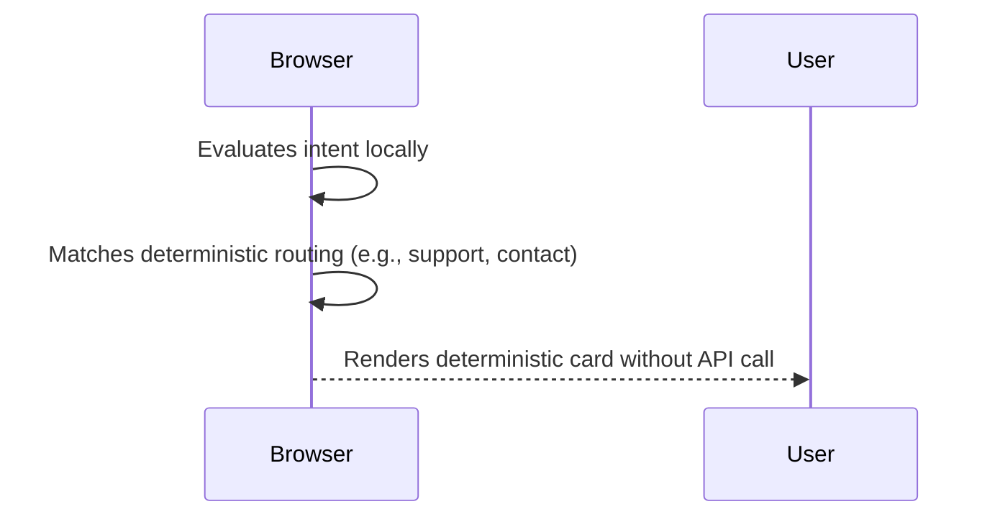
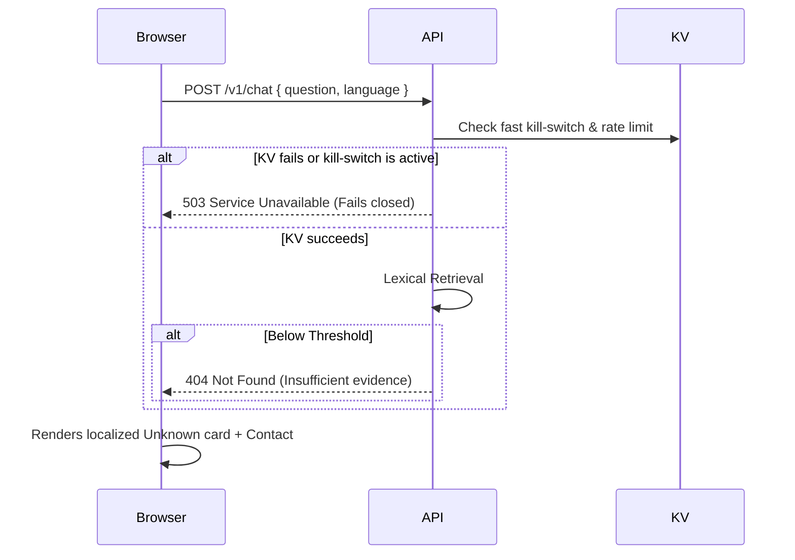
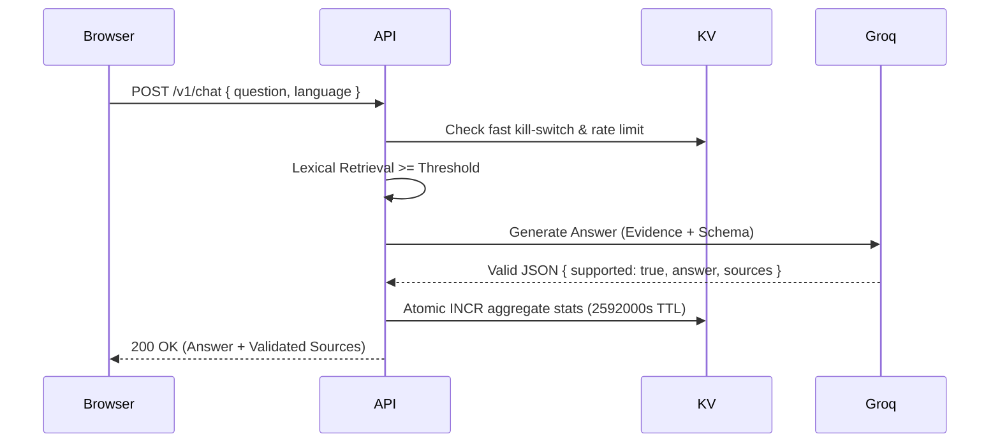
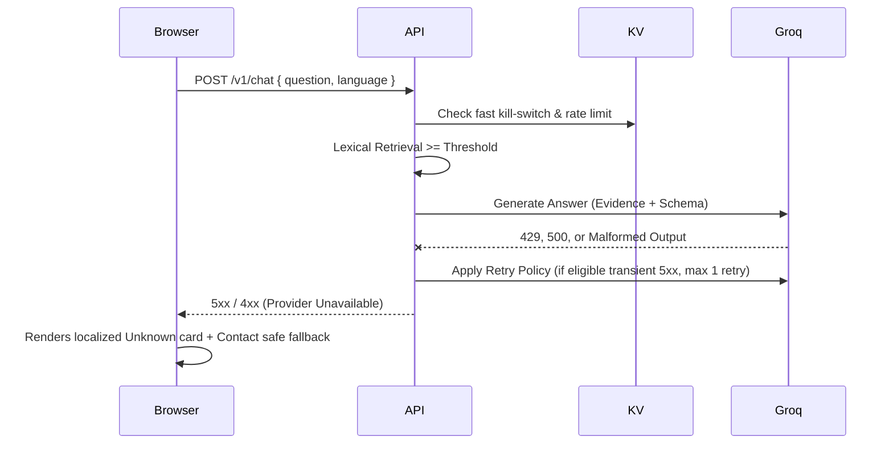

# Design: Chatbot Stage 2 Grounded AI

## Technical Approach
Preserve the static frontend (`src/`) for reduced blast radius. Introduce an isolated, independently deployed Vercel Serverless API (`chat-api/`) in the same repository via npm workspaces. This topology ensures server secrets never leak to the browser. The API uses deterministic lexical retrieval over a versioned `KnowledgeRepository` to securely inject evidence into Groq via a provider-neutral adapter. Operational quotas and telemetry use an isolated Upstash Redis instance (distinct from any CMS DB).

## Architecture Decisions
- **API Deployment**: Same-repo isolated Vercel API. Prevents frontend server-package pollution. Independent rollback.
- **Model**: `meta-llama/llama-4-scout-17b-16e-instruct`. Documented strict-schema support, configurable via ENV.
- **Rate-limit ID**: `HMAC-SHA256(canonical IP + time bucket, HMAC_SECRET)`. No raw IP logging.
- **Telemetry**: Atomic Redis Counters (`HINCRBY`), 30d TTL.
- **Retry Policy**: Max 1 retry for transient/eligible 5xx. No retries for validation, auth, 429, malformed output, or removal.

## Data Flow Sequences

**1. Deterministic Answer**
Browser evaluates intent locally and matches existing deterministic routing. No API call is made.


**2. Insufficient Evidence / KV Outage / Kill-Switch**
API called, but provider is skipped due to kill switch, KV failure, or lack of evidence.


**3. Grounded Answer**
Ideal path returning a validated response.


**4. Provider Failure**
Groq is called, but fails. The API attempts retries and falls back safely.


**5. Active Flow Interruption**
An open-ended question interrupts an existing deterministic flow.
```mermaid
sequenceDiagram
    Browser->>Browser: User in active "Quotation" flow
    Browser->>API: User asks open-ended question
    API-->>Browser: 200 OK (Answer)
    Browser-->>User: Renders Answer
    Browser->>Browser: Quotation state suspended; requires explicit user action to resume.
```

## Interfaces & Knowledge Schema

**API Schema (`packages/contracts/chat.ts`)**:
```typescript
export interface ChatRequest { question: string; language: "es" | "en" | "pt"; }
export type ChatResultCode = "SUCCESS" | "UNKNOWN" | "PROVIDER_UNAVAILABLE" | "RATE_LIMITED" | "DISABLED" | "INVALID_REQUEST";
export interface ChatResponse {
  code: ChatResultCode;
  supported: boolean;
  answer?: string;
  language?: "es" | "en" | "pt";
  sources?: { id: string; title: string; url?: string }[]; // title is safe/localized
}
```

**Knowledge Repository (`packages/knowledge/types.ts`)**:
```typescript
export interface KnowledgeEntry {
  id: string;
  status: "approved" | "draft";
  owner: string; // approvedBy
  title: { es: string; en: string; pt: string }; // Localized display title
  claims: string[]; // Approved body/facts
  aliases: { es: string[]; en: string[]; pt: string[] };
  tags: string[]; // Weighted keywords
  url?: string; // Validated https://ijac.com.ar/...
  version: number;
  approvedAt: string;
  reviewedAt: string; // Freshness marker
  validationRules?: string[]; // Context/Business constraints
}
export interface KnowledgeRepository { getEntries(): Promise<KnowledgeEntry[]>; }
```

## Lexical Retriever Details
- **Normalization**: Lowercase, diacritic folding, stop-word stripping.
- **Scoring**: Term frequency. Weights: `tags` (3x), `title` (2x), `aliases` (2x), `claims` (1x).
- **Threshold & Top-K**: K=3. Absolute minimum threshold required. Below threshold = fail closed (no Groq call).
- **Ties/Ambiguity**: Highest version/freshness wins ties. Close ambiguity scores return all up to K.
- **Calibration**: Managed via versioned adversarial fixtures.

## Runtime Configuration Contract

The system enforces strict startup validation and safe defaults. If required configuration is missing or invalid, the API fails closed. A strict no-secret frontend boundary is maintained.

| Scope | Key | Description / Validation |
|---|---|---|
| **Frontend (Build)** | `NEXT_PUBLIC_ENABLE_AI_CHAT` | Toggles UI. Takes effect only after static frontend rebuild/redeploy. |
| **Frontend (Build)** | `NEXT_PUBLIC_CHAT_API_URL` | Route to Vercel API. |
| **Frontend (Build)** | `NEXT_PUBLIC_API_CONTRACT_VERSION`| API version expected by frontend (e.g., `v1`). |
| **API (Deploy)** | `API_CONTRACT_VERSION` | v1 compatibility rules enforced. |
| **API (Deploy)** | `DISABLE_API` | Deploy-time env fallback flag. Fails closed, takes effect only after API redeployment (never instant). |
| **API (Deploy)** | `GROQ_API_KEY`, `GROQ_MODEL` | Provider credentials/model. |
| **API (Deploy)** | `GROQ_TIMEOUT`, `GROQ_RETRIES` | Max 1 retry. |
| **API (Deploy)** | `UPSTASH_REDIS_REST_URL` | Canonical Upstash URL. KV outage fails closed without provider calls. |
| **API (Deploy)** | `UPSTASH_REDIS_REST_TOKEN` | Canonical Upstash Token. |
| **API (Deploy)** | `HMAC_SECRET` | Secret for hashing IPs. |
| **API (Deploy)** | `ALLOWED_ORIGINS` | Exact CSV of production/preview origin sets. No wildcards. |
| **API (Deploy)** | `QUOTA_PER_CLIENT`, `QUOTA_GLOBAL` | Parsed as integers. |
| **API (Deploy)** | `TELEMETRY_TTL_SECONDS` | Expected `2592000` (30 days) for aggregate-counter expiry. |
| **KV (Operational)**| `kv_kill_switch` | Fast operational toggle. Immediate when KV is available. Checked before Groq/retrieval. |
| **KV (Operational)**| `stats_aggregate_*` | Bounded aggregate keys for telemetry metrics. |

**CORS Policy**: No wildcards. Production uses exact `https://ijac.com.ar`. Previews MUST explicitly register their exact origin in the preview ENV; unlisted origins are rejected. CORS is not abuse protection; frontend handles blocked/network errors via safe local fallback.

## Kill-Switch & Failure Modes
1. **Operational KV Switch**: Owner sets `kv_kill_switch=true` in Upstash console. This is immediate when KV is available.
2. **Deploy-Time Switch**: `DISABLE_API=true` fails closed, but takes effect only after API redeployment (never instant).
3. **KV Unavailability**: If Redis timeouts/fails, the API fails closed (503 DISABLED) without making provider calls to prevent unmetered traffic.
4. **Frontend Rollback**: Handled via updating `NEXT_PUBLIC_ENABLE_AI_CHAT=false` and triggering a static frontend rebuild/redeploy.

## Spec Traceability

| Requirement | Design Component | Verification Evidence |
|---|---|---|
| **Hybrid/State** | Frontend Precedence, Interruption Sequence | Unit tests asserting explicit resume action on active flow. |
| **Contract** | Zod strict schemas, Config validation | Integration tests rejecting extra fields/origins. |
| **Governance** | `KnowledgeEntry` schema complete fields | Unit tests strictly querying `status: approved` & freshness. |
| **Retrieval** | Lexical scoring (Tags 3x, Title 2x) | Fixture calibration tests asserting K=3 thresholds. |
| **Output/Lang** | `ChatResponse` union lang, Localized Title | Adapter tests with malformed/unsupported fakes. |
| **Privacy** | HMAC IP, Atomic Counters, 2592000s TTL | Integration tests ensuring no raw logs; Redis TTL checks. |
| **Controls** | Timeout, 1 Retry, Fast KV Kill-switch | Fake provider timeout tests. KV failure tests (fail closed). |
| **Accessibility**| Async state, keyboard-accessible | E2E tests validating Escape support, focus states, no traps. |

## Release Gates
- [ ] Owner approval of `KnowledgeRepository` entries and localized handoff copy.
- [ ] Verification of Groq privacy policy and free-tier availability for `meta-llama/llama-4-scout-17b-16e-instruct`.
- [ ] Retention of Upstash account capability/quota verification as a release gate (no unverified numeric quota claims).
- [ ] DNS configuration/handoff for `api.ijac.com.ar` and exact preview origins.
- [ ] Accessibility: Keyboard accessible, context retention, explicit focus, no traps.
